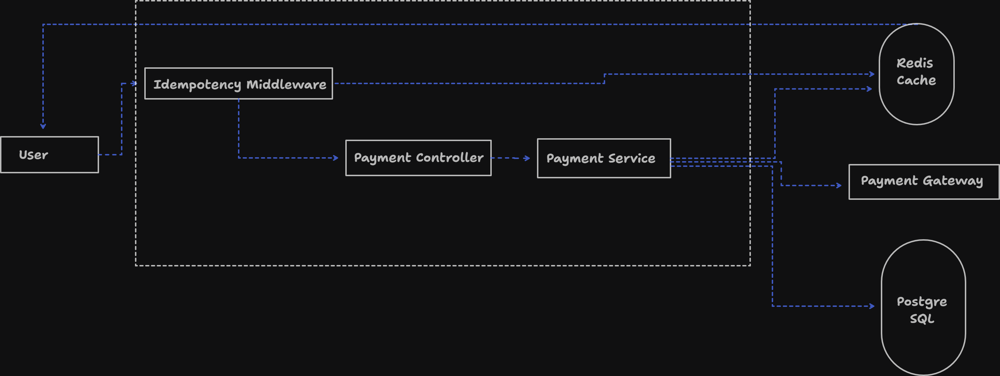
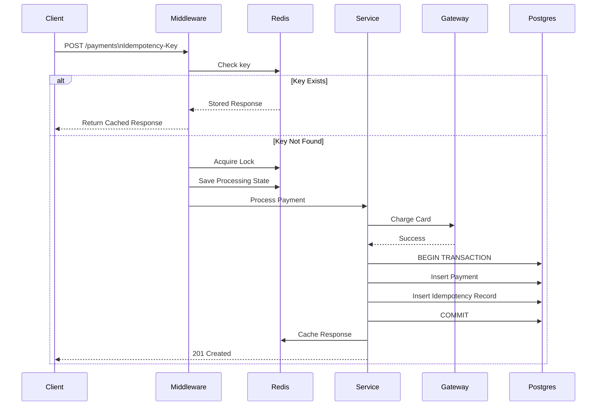
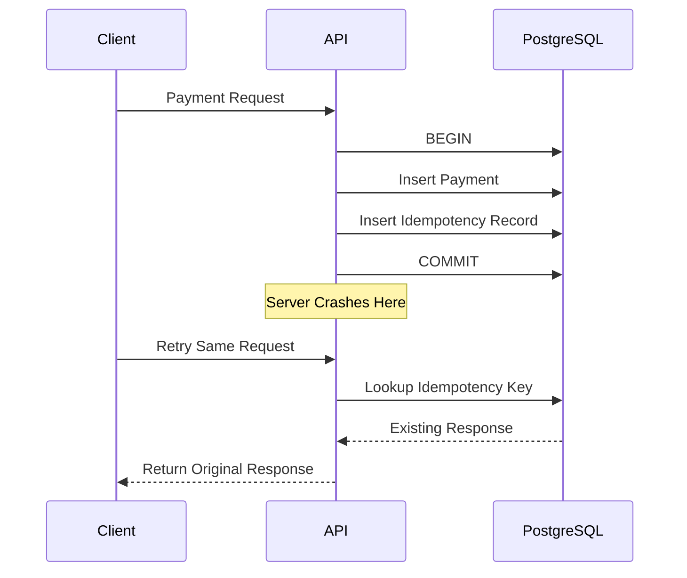

## Failure Scenarios Tested

| Scenario                     | Result                     |
| ---------------------------- | -------------------------- |
| Same Request Retry           | Cached Response Returned   |
| Same Key + Different Payload | 422 Returned               |
| Gateway Failure              | Transaction Rolled Back    |
| Server Crash Before Commit   | No Data Persisted          |
| Server Crash After Commit    | Retry Replays Response     |
| Concurrent Requests Same Key | Only One Payment Created   |
| Redis Lock Collision         | Duplicate Request Rejected |

#

#

# System Architecture Diagrams

## Architecture

## Request Flow Diagram

## Atomic Transaction Diagram

## Retry Handling Diagram

## Crash Recovery Scenario

## Backend Concepts Covered

### Reliability

- Idempotency Keys
- Request Hash Validation
- Distributed Locking
- Retry Safety
- Crash Recovery

### Database

- PostgreSQL Transactions
- ACID Guarantees
- Unique Constraints
- JSONB Storage
- UUID Primary Keys

### Caching

- Redis
- TTL Expiration
- Response Replay
- Processing State Tracking

### Payment Processing

- Payment Gateway Integration
- Failure Simulation
- Duplicate Charge Prevention

### Distributed Systems

- Exactly Once Processing
- Concurrency Control
- Race Condition Prevention
- Atomic Writes

### API Design

- REST APIs
- Middleware Pattern
- Error Handling
- Status Code Consistency
